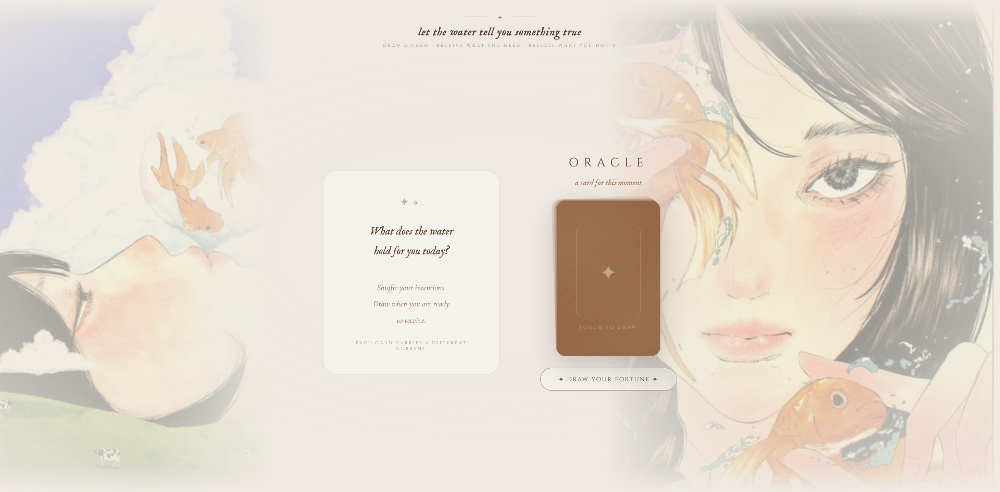

```
 ~~~~~~~~~~~~~~~~~~~~~~~~~~~~~~~~~~~~~~~
  ___  ___    _   ___ _    ___
 / _ \| _ \  /_\ / __| |  | __|
| (_) |   / / _ \ (__| |__| _|
 \___/|_|_\/_/ \_\___|____|___|

        F O R T U N E   C A R D S
 ~~~~~~~~~~~~~~~~~~~~~~~~~~~~~~~~~~~~~~~
```

> *let the water tell you something true*

A dreamy, watercolor-themed fortune card web app. Draw a card, watch it flip, and receive a short piece of wisdom pulled from a mood-matched pool of quotes — auspicious, difficult, contemplative, or whimsical.

## Preview



## Features

- **21 unique cards**, each with a symbol, name, and keyword, spread across four moods:
  - `good` — auspicious / hopeful
  - `bad` — difficult / growth
  - `neutral` — contemplative / philosophical
  - `funny` — whimsical / lighthearted
- **Mood-matched fortunes** — after a card is drawn, a quote is pulled from the matching mood's pool (mix of real quotes and original oracle-style lines)
- **3D flip animation** for the card draw, plus a soft slide-in for the result panel
- Two layered background illustrations with custom CSS masking so they fade toward the center of the page
- Fully **vanilla JS** — no frameworks, no build step
- Custom Google Fonts (Cormorant Garamond, Cinzel, IM Fell English) for the tarot-parlor aesthetic

## Project Structure

```
.
├── index.html   # markup
├── style.css    # layout, theme, animations
├── main.js      # card data, fortune pools, draw logic
├── img1.jpg     # left background illustration
├── 3f32f...jpg  # right background illustration
├── eye.jpg      # favicon
└── SS.png       # screenshot (for this README)
```

## Running It Locally

No dependencies, no build tools — just open it:

```bash
git clone <your-repo-url>
cd oracle-fortune-cards
open index.html   # or just double-click it
```

Or serve it locally if you'd rather not rely on `file://`:

```bash
python3 -m http.server 8000
# then visit http://localhost:8000
```

## How It Works

1. Click **"Draw your fortune"** (or click the card itself).
2. A random card is selected from the `cards` array in `main.js` and the card flips to reveal its symbol, name, and keyword.
3. Based on the card's `mood`, a fortune is pulled from the matching pool in the `fortunes` object and displayed alongside a mood badge.
4. Click **"draw again"** to reset and draw a new card.

## Customizing

- **Add a card:** append an object to the `cards` array with `name`, `symbol`, `word`, and `mood`.
- **Add a fortune:** append `{ text, author }` to the matching mood array inside `fortunes`.
- **Change the look:** all theming lives in `style.css` as HSL color values, so palette tweaks are just hue/saturation/lightness edits.

## License

Add your license of choice here.
